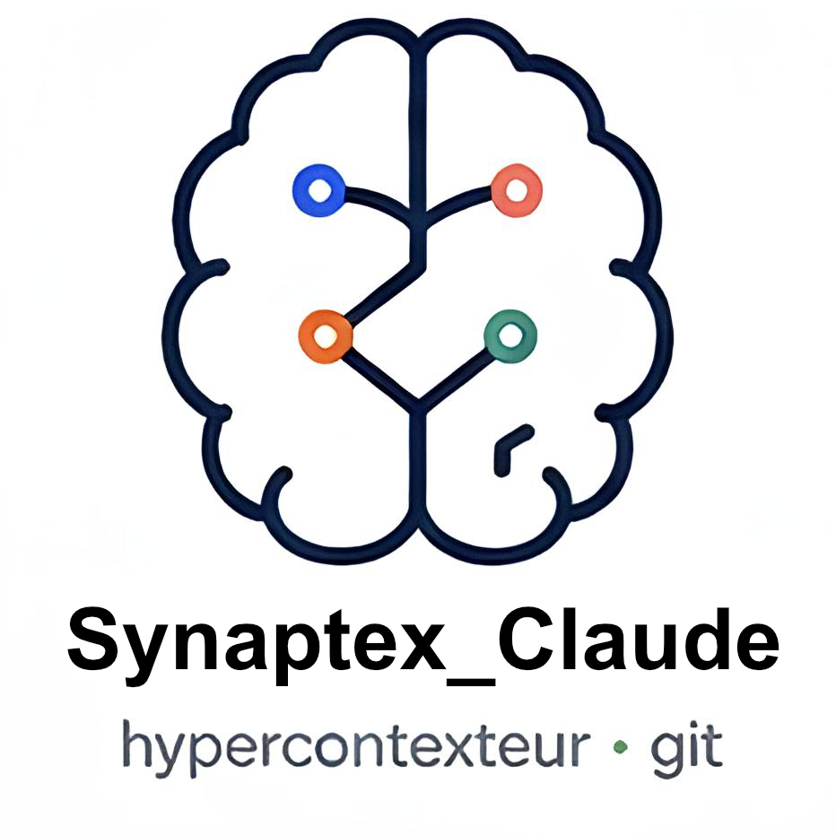

<p align="center">
  
</p>

# Synaptex

Global brain for all your Claude Code projects.  
Synaptex syncs your `CLAUDE.md` files across repos, builds a semantic index, and exposes everything to Claude via MCP.

Portable across operating systems (Linux x86/ARM, macOS, Windows WSL), Git hosts (Forgejo, Gitea, GitHub, GitLab, or just local folders), and embedding providers (Ollama, OpenAI, LM Studio, vLLM, LocalAI…).

---

## Quick start

```bash
git clone <this-repo> ~/Synaptex
cd ~/Synaptex

bash install.sh                     # standard setup (embed backend)
# or:
bash install.sh --enable-leann      # adds BM25+vector search (~3 GB extra)

synaptex init                         # interactive wizard
synaptex sync                         # first sync + index
synaptex search "your query"
```

---

## Prerequisites

- Python 3.10+ with `pip install requests`
- A repo source (one of: Forgejo, Gitea, GitHub, GitLab, or local folders)
- For semantic search: [Ollama](https://ollama.com) (local or remote) with an embedding model pulled — **not required** if you use the `fts5` backend

---

## Five forge providers, one variable

`GIT_TYPE` in `~/.synaptex/.env`:

| Value | API used | Token scope |
|---|---|---|
| `forgejo` | Forgejo API v1 (`/api/v1/...`) | `read:repository` |
| `gitea` | Gitea API v1 (same as Forgejo) | `read:repository` |
| `github` | GitHub REST API v3 | `repo` (read) |
| `gitlab` | GitLab REST API v4 | `read_api` |
| `local` | Filesystem scan (no API) | none |

**`local` is the most universal**: point `LOCAL_REPOS_PATH` to a folder containing your Git repos, and Synaptex reads `CLAUDE.md` files directly from disk. No tokens, no network, fully offline.

---

## Three search backends, one switch

`SYNAPTEX_SEARCH_BACKEND` in `~/.synaptex/.env`:

| Value | Quality | Network needs | Disk cost | Use when |
|---|---|---|---|---|
| `embed` (default) | Semantic similarity (cosine) | Ollama (local or remote) | ~tens of MB | You have an embedding provider |
| `leann` | BM25 + vector hybrid (best) | Ollama | ~3 GB (PyTorch) | Quality matters more than disk |
| `fts5` | Keyword (SQLite FTS5) | None | Negligible | Fully offline, no Ollama |

You can switch at any time — re-run `synaptex sync` to repopulate the index in the new backend.

### Supported embedding providers

- **Ollama** (default) — any model available via `ollama pull`
- **OpenAI-compatible** — LM Studio, vLLM, LocalAI, OpenAI API: set `OLLAMA_API_TYPE=openai`

---

## Configuration

`~/.synaptex/.env` (created by `synaptex init` or `install.sh`, chmod 600):

| Variable | Description | Example |
|---|---|---|
| `GIT_TYPE` | Source type | `forgejo` \| `gitea` \| `github` \| `gitlab` \| `local` |
| `FORGE_URL` | Forge base URL (not needed for `github` or `local`) | `http://localhost:3000` |
| `FORGE_TOKEN` | API token with read access | `abc123...` |
| `FORGE_USER` | Your username on the forge | `alice` |
| `LOCAL_REPOS_PATH` | Local folder to scan (when `GIT_TYPE=local`) | `~/projects` |
| `SYNAPTEX_INCLUDE_PATTERNS` | Files to index per repo (comma-separated) | `CLAUDE.md` \| `CLAUDE.md,README.md` \| `*.md` |
| `SYNAPTEX_SEARCH_BACKEND` | Search engine | `embed` \| `leann` \| `fts5` |
| `OLLAMA_BASE_URL` | Ollama or OpenAI-compatible API | `http://localhost:11434` |
| `OLLAMA_API_TYPE` | API format | `ollama` \| `openai` |
| `OLLAMA_EMBED_MODEL` | Embedding model | `nomic-embed-text` |
| `OLLAMA_FALLBACK_MODEL` | Fallback model (optional) | `mxbai-embed-large` |
| `OLLAMA_API_KEY` | API key for OpenAI-compatible APIs (optional) | `sk-...` |

---

## Commands

### `synaptex init`
Interactive wizard — generates `~/.synaptex/.env`.

### `synaptex status`
Check connectivity: forge, Ollama, embedding model, index, backend.

### `synaptex sync`
Download files matching `SYNAPTEX_INCLUDE_PATTERNS`, generate memory sheets, re-index.

```bash
synaptex sync --dry-run              # preview without writing
synaptex sync                        # full sync
synaptex sync --no-index             # sync without re-indexing
synaptex sync --only mon-projet      # sync a single repo
synaptex sync --exclude tests        # exclude repos by name (repeatable)
synaptex sync --exclude ci --exclude sandbox
```

### `synaptex search`
Semantic (or keyword, depending on backend) search across all indexed files.

```bash
synaptex search "raspberry pi backup strategy"
synaptex search "authentication API" -k 3
```

### `synaptex map`
Generate `~/.synaptex/index.md` — a global map with a Mermaid dependency graph.

### `synaptex context`
Generate an injectable context block for a Claude session.

```bash
synaptex context                  # all projects
synaptex context myrepo otherrepo # filtered
```

---

## Claude Code integration

### Slash command `/user:synaptex`

At the start of a session, type `/user:synaptex` to load global context.  
With specific projects: `/user:synaptex myrepo otherrepo`

Claude will:
1. Run `synaptex context` and read the result
2. Query past session memories via qmd (if installed)
3. Confirm: "🧠 Synaptex loaded — active projects: [list]"

### MCP `synaptex-search`

Available tools directly in Claude Code during a conversation:

| Tool | Usage |
|---|---|
| `synaptex_search` | Search across CLAUDE.md files |
| `synaptex_list` | List all synced projects |
| `synaptex_context` | Return a project's context |
| `synaptex_status` | Infrastructure status |

---

## Compatibility matrix

| Platform | Status | Notes |
|---|---|---|
| Linux x86_64 | ✅ Tested | Native |
| Linux aarch64 (Pi 4/5) | ✅ Tested | `embed`/`fts5` backends recommended; `leann` works but install is slow |
| macOS Apple Silicon | ✅ Should work | Bun + qmd binaries native; Ollama runs natively |
| macOS Intel | ✅ Should work | Same as above |
| Windows (WSL2) | ✅ Should work | Treat as Linux |
| Windows (Git Bash) | ⚠️ Partial | `install.sh` skips `~/.local/bin` symlink — use `python3 synaptex.py` directly |

---

## File layout

```
~/.synaptex/
├── .env              ← secrets (chmod 600, never committed)
├── projects/         ← CLAUDE.md mirror (one folder per repo)
├── memory/           ← generated memory sheets
├── index.md          ← global map (synaptex map)
├── leann_index/      ← vector index (sqlite3 + optional leann)
└── sync.log          ← sync history

<repo>/
├── synaptex.py         ← CLI (Click)
├── forge.py          ← multi-forge bridge (forgejo/gitea/github/gitlab/local)
├── embed.py          ← vector index (sqlite3 + cosine + OpenAI-compatible)
├── search.py         ← search backend router (embed/leann/fts5)
├── memory.py         ← memory sheets + Mermaid graph
├── context.py        ← injectable context block
├── mcp_synaptex.py     ← MCP server (stdio)
└── install.sh        ← full setup
```

---

## Troubleshooting

**Ollama not responding**
```bash
curl http://localhost:11434/api/tags   # check it's running
ollama pull nomic-embed-text           # pull the default embed model
```

**Forge unreachable**
- For remote Forgejo/GitLab: check VPN or network connectivity
- For GitHub: verify your token has `repo` scope
- For `local`: verify `LOCAL_REPOS_PATH` points to a folder containing `.git/` directories

**Index empty after sync**
```bash
synaptex status           # check embed model is available
synaptex sync             # re-run sync
```

**Want offline search (no Ollama)**
```bash
# In ~/.synaptex/.env:
SYNAPTEX_SEARCH_BACKEND=fts5
synaptex sync   # re-index with FTS5
```

**Want best search quality**
```bash
bash install.sh --enable-leann
# Then in ~/.synaptex/.env:
SYNAPTEX_SEARCH_BACKEND=leann
synaptex sync
```

**qmd not found**
```bash
export PATH="$HOME/.bun/bin:$PATH"
```

---

## License

See [LICENSE](LICENSE) if present, or contact the repo owner.
